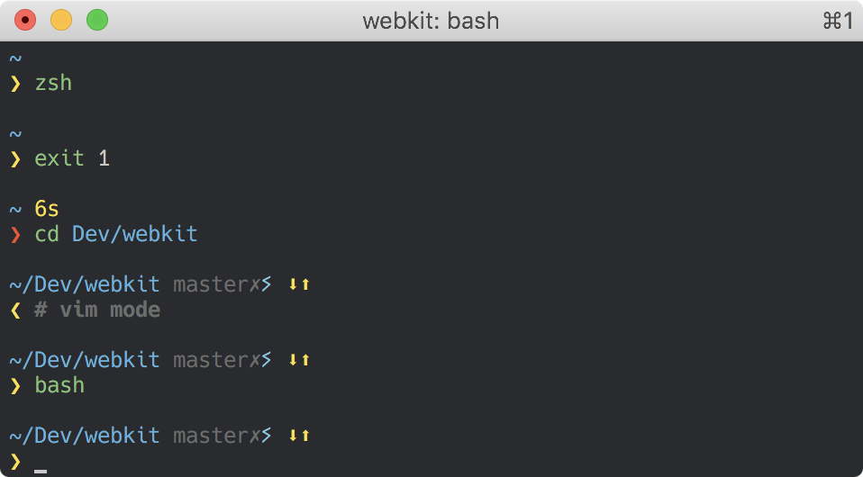
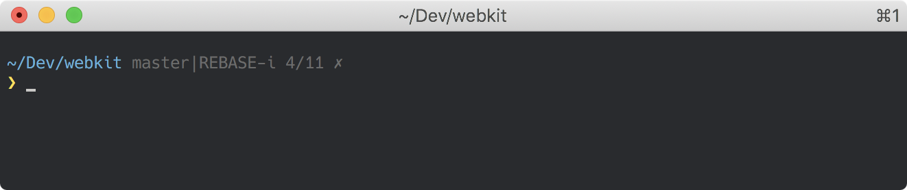

# Patatetoy Prompt

[](https://travis-ci.org/loliee/prompt-patatetoy)

> Pretty, minimal and fast `Zsh/Bash` prompt, initialy forked from [pure](https://github.com/sindresorhus/pure).



## Why ?

- Add a bash version.
- Add git rebase/merge steps.
- Add flat configuration vars for colors and symbols, see [#options] section.

## Install

Clone repository.

```bash
git clone https://github.com/loliee/prompt-patatetoy.git "$HOME/.patatetoy"
```

### Zsh

```
# .zshrc
fpath=( "$HOME/.patatetoy" $fpath )

autoload -U promptinit && promptinit
prompt patatetoy
```

### Bash

```
# .bashrc
source "$HOME/.patatetoy/patatetoy.sh
```

## Options

### Symbols

| var                                          | default                | description                                                                                                   |
|----------------------------------------------|:----------------------:|---------------------------------------------------------------------------------------------------------------|
| `PATATETOY_PROMPT_SYMBOL`                    | `❯`                    | Character to use as prompt symbol.                                                                            |
| `PATATETOY_GIT_DIRTY_SYMBOL`                 | `✗`                    | Character to use if git repository is dirty.                                                                  |
| `PATATETOY_GIT_UP_ARROW`                     | `⬆`                    | Git upstream forward char.                                                                                    |
| `PATATETOY_GIT_DOWN_ARROW`                   | `⬇`                    | Git upstream behind char.                                                                                     |
| `PATATETOY_GIT_STASH_SYMBOL`                 | `ⵢ`                    | Character to use if stash exists.                                                                             |
| `PATATATETOY_ROOT_SYMBOL`                    | `✦`                    | Define ROOT user warning symbol.                                                                              |

### Colors

Possible colors are: `black` `red` `green` `yellow` `blue` `magenta` `cyan` `grey` `darkgrey` `white`.

| var                                          | default                | description                                                                                                   |
|----------------------------------------------|:----------------------:|---------------------------------------------------------------------------------------------------------------|
| `PATATETOY_CURSOR_COLOR_OK`                  | `yellow`               | Define cursor color for sucessed previous command.                                                            |
| `PATATETOY_CURSOR_COLOR_KO`                  | `red`                  | Define cursor color for failed previous command.                                                              |
| `PATATETOY_GIT_ARROW_COLOR`                  | `yellow`               | Define git upstream arrow's color.                                                                            |
| `PATATETOY_GIT_BRANCH_COLOR`                 | `darkgrey`             | Define branch color.                                                                                          |
| `PATATETOY_GIT_DIRTY_SYMBOL_COLOR`           | `darkgrey`             | Define dirty symbol color.                                                                                    |
| `PATATETOY_GIT_STASH_COLOR`                  | `cyan`                 | Define stash symbol color.                                                                                    |
| `PATATETOY_PATH_COLOR`                       | `blue`                 | Define path color.                                                                                            |
| `PATATETOY_ROOT_SYMBOL_COLOR`                | `red`                  | Define root symbol color.                                                                                     |
| `PATATETOY_USERNAME_COLOR`                   | `red`                  | Define hostname/username color.                                                                               |
| `PATATETOY_VIRTUALENV_COLOR`                 | `darkgrey`             | Define virtualenv color.                                                                                      |

### Settings

| var                                          | default                | description                                                                                                   |
|----------------------------------------------|:----------------------:|---------------------------------------------------------------------------------------------------------------|
| `PATATETOY_SRC_DIR`                          | `${HOME}/.patatetoy`   | Define source directory path.                                                                                 |
| `PATATETOY_FORCE_DISPLAY_USERNAME`           | `0`                    | Force username & host display.                                                                                |
| `PATATETOY_GIT_DIRTY_CHECK`                  | `1`                    | Disable dirty check. Only useful with `bash prompt version` and on extremely huge repos like the WebKit repo. |
| `PATATETOY_GIT_UNTRACKED_DIRTY`              | `1`                    | Set to `0` to not include untracked files in dirtiness check.                                                 |
| `PATATETOY_GIT_PULL`                         | `0`                    | Set `0` to prevent Patatetoy from checking whether the current Git remote has been updated.                   |
| `PATATETOY_CMD_MAX_EXEC_TIME`                | `5`                    | The max execution time (in seconds) of a process before its run time is shown when it exits.                  |
| `PATATETOY_GIT_DELAY_DIRTY_CHECK` (zsh only) | `1800`                 | Time in seconds to delay git dirty checking for large repositories (git status takes > 2 seconds).            |

## Example

```sh
# .zshrc

autoload -U promptinit && promptinit

# optionally define some options
PATATETOY_CMD_MAX_EXEC_TIME=10
PATATETOY_FORCE_DISPLAY_USERNAME=1
PATATETOY_USERNAME_COLOR=red

prompt patatetoy
```

## Screenshots

### Rebase



## Tips

- [patatetoy](https://github.com/loliee/patatetoy) dynamic and light colorscheme for dailyuse.
- [zsh-syntax-highlighting](https://github.com/zsh-users/zsh-syntax-highlighting), to colorized output.
- [sshrc](https://github.com/Russell91/sshrc), to bring the light bash version with you when you ssh.

## License

MIT © Maxime Loliée

## Author

- [Maxime Loliée](http://github/loliee)
- [Sindre Sorhus](http://sindresorhus.com)
